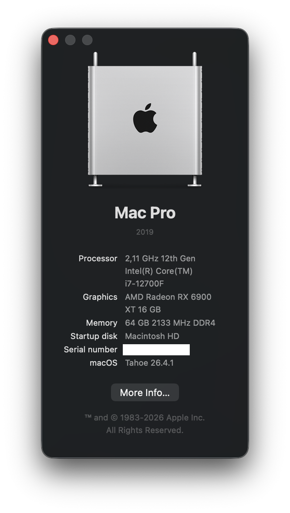

# Specs

# Components

- Aorus B660I Pro DDR4
- Intel I225 - Ethernet
- AirportItlwm.kext - WiFi & Bluetooth
- 12th Gen Intel(R) Core(TM) i7-12700F
- RX 6900 XT & worked before with RX 6600
- Bluetooth Adapter https://www.amazon.de/dp/B0CXXX68BL?ref_=ppx_hzsearch_conn_dt_b_fed_asin_title_1&th=1
- AppleALC

# macOS

- Sonoma - works
- Sequoia
  - AirportItlwm.kext doesn't work anymore - no WiFi & no Bluetooth
  - AppleALC doesn't work anymore - no audio
- Tahoe 26.4.1 - works
  - Requires `-lilubetaall` boot-arg, otherwise the GPU (RX 6900 XT) doesn't work - found via [this Reddit comment](https://www.reddit.com/r/hackintosh/comments/1l7v6yd/comment/mx03ue5/?utm_source=share&utm_medium=web3x&utm_name=web3xcss&utm_term=1&utm_content=share_button)
  - WiFi doesn't work - not investigated (not needed, using Ethernet, Intel I225 works)
  - Bluetooth works

# Tools

- [ProperTree](https://github.com/corpnewt/ProperTree) - fine-grained editing of `config.plist`
- [MountEFI](https://github.com/corpnewt/MountEFI) - mounting the EFI partition
- [OCAuxiliaryTools](https://github.com/ic005k/OCAuxiliaryTools) - does all of the above in one place (mount EFI, open/edit `config.plist`, update kexts and OpenCore itself) for when fine-grained editing isn't needed
- `Utilities/macserial` (bundled in this repo) - generate/verify `SystemSerialNumber` & `MLB`
- `Utilities/CreateVault/sign.command` (bundled in this repo) - re-sign/vault the build after editing `config.plist`, otherwise boot breaks

# Reusing this config.plist

`SystemSerialNumber`, `MLB`, `SystemUUID` and `ROM` in `EFI/OC/config.plist` are left blank in this repo. If you reuse this config, don't forget to generate and fill in your own values for these (e.g. with `macserial`/GenSMBIOS) - don't reuse mine or leave them blank on a real build.

# Trivia

When I started with Ruby on Rails in 2013, a colleague planted in me the idea of making a Hakintosh, and so I've made one based on i5-4570K. The one above is the 3rd one I've built. Old habits die hard.

# Alpenföhn Black Ridge + B660I

Is to be avoided, because of one of the heatsinks on the motherboard and the radiator don't fit together.
